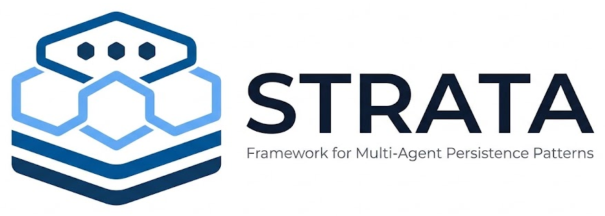

# Strata

<p align="center">
  
</p>

A drop-in workflow that gives AI coding agents memory that lasts across
sessions, plus clean handovers between agents, in any project at any stage.
The name comes from rock strata: each agent adds a layer on top, and nothing
underneath gets rewritten.

## What it does

Once installed, any Claude agent that opens the project:

1. **Picks it up automatically.** Claude Code always loads `CLAUDE.md`, and
   Strata puts a short block at the top of it that sends the agent to
   `STRATA.md` and tells it what to do before its first action.
2. **Checks the current state first.** It lists `strata/context/artifacts/`
   and reads each task's status and *whose move it is*. Work another agent
   left unfinished (`-PART`) is visible immediately.
3. **Records work on disk, not in chat.** Each task gets a folder of numbered,
   never-edited iterations with evidence and a handover report, so the next
   session or agent continues instead of starting over.
4. **Keeps a current map of the project** in `strata/docs/`, written only
   when an agent had to work something out the next one will need again.
   Entries human developers would also want are tagged `[for-humans]`, so
   you can find them with `grep -rn "\[for-humans\]" strata/docs` and decide
   whether to move them into the project's own docs.
5. **Keeps the repo clean.** Probes and debug leftovers come out before
   shipping, and working memory only reaches git when the mode allows it
   (`.gitignore` plus a pre-commit hook).

How far along the project is doesn't matter. Existing history, docs and
TODO files stay as they are, and artifacts start from the day you install.

## What it adds to a project

```
STRATA.md            the rules (workflow only, no project facts)
strata/
  context/           working memory: artifacts, evidence, externals, scratch
  docs/              the agents' living map of the project
```

Everything Strata owns is in those two places, plus a marked block in
`CLAUDE.md` and in `.gitignore`. The names are chosen so they don't collide
with a project's own files. The installer refuses to touch a `STRATA.md` or
`strata/` it didn't create.

## Modes: local (default) and shared

| | **local** (default) | **shared** (cross-team) |
|---|---|---|
| `strata/context/artifacts/` | stays on this machine | committed with the code, so it travels with pushes, branches and PRs |
| `strata/context/evidence/`, `externals/`, `scratch/` | stays on this machine | stays on this machine |
| `strata/docs/` | committed | committed |
| who can pick up the work | later sessions and parallel agents on this machine | anyone who checks out the branch: teammates, your other machines, cloud agents |
| leak risk | none through git (except `strata/docs/`, which holds no secrets by rule) | artifact text is pushed, so no secrets, client data or raw logs in it (the hook blocks common key formats) |
| use it when | one person, one machine | more than one person or machine needs the handoff |

**Use local unless you need cross-team handoff.** It's the safest choice,
and agents can write messy, honest notes without thinking about who will
read them. Switch a project to shared when a teammate needs to pick up where
you left off.

The mode is stored in the managed block in the project's `.gitignore`, so
everyone who clones the repo gets the same mode. Rerunning the installer
without a mode keeps the current one.

## What gets installed

| file | committed? | purpose |
|---|---|---|
| `STRATA.md` | yes | the full rulebook: modes, artifacts, iteration naming, handovers, docs, parallel agents, shipping |
| `CLAUDE.md` | yes | short managed block (between `strata` markers) that triggers the workflow |
| `AGENTS.md` | yes | same block, only if the project already has an `AGENTS.md` (for other agent tools) |
| `.gitignore` | yes | managed block that records the mode and ignores `strata/context/` accordingly |
| `strata/docs/INDEX.md` | yes | one-page map of the agents' docs (created only if missing) |
| `strata/context/artifacts/` | local: **no** / shared: **yes** | task folders: status, iterations, handover reports |
| `strata/context/evidence/` | **no** | raw logs, dumps and probe output, always local |
| `.git/hooks/pre-commit` | no (per clone) | refuses `strata/context/` paths the mode doesn't allow; in shared mode also refuses artifacts containing key/token formats |

Anything already in your `CLAUDE.md` is kept. The block is inserted below the
first heading, and rerunning the installer only refreshes the block.

## Installing

### Option A: ask Claude (easiest, works anywhere)

Open the project in Claude Code and say:

> Install Strata from `<path-to-strata>` into this project, following its
> README. In `STRATA.md`, change only workflow settings such as the branch
> name. Put project facts (stack, build and test commands) in `CLAUDE.md`,
> not `STRATA.md`.

Claude can also adjust details the script can't, such as `main` vs `master` in
the git commands, or merging the hook into an existing Husky/pre-commit setup.
`STRATA.md` stays workflow-only: project facts written there go stale
unnoticed, while `CLAUDE.md` and `strata/docs/` are kept current.

### Option B: run the script

Replace `<path-to-strata>` with wherever you keep this folder.

PowerShell (Windows):

```powershell
& "<path-to-strata>\install.ps1" -Target C:\path\to\project
```

If PowerShell blocks the script, run it once with
`powershell -ExecutionPolicy Bypass -File <path-to-strata>\install.ps1 -Target <project>`.

Git Bash / macOS / Linux:

```bash
bash "<path-to-strata>/install.sh" /path/to/project
```

For cross-team handoff, add `-Mode shared` (PowerShell) or `--mode shared`
(bash). The same flag switches an existing project between modes:

```powershell
& "<path-to-strata>\install.ps1" -Target C:\path\to\project -Mode shared
```

Then commit the tracked files:

```bash
git add STRATA.md CLAUDE.md .gitignore strata/docs && git commit -m "Add Strata agent workflow"
```

Switching shared back to local stops new artifacts being committed, but
artifacts already pushed stay in git history, and git keeps tracking them.
Run `git rm -r --cached strata/context/` once and commit it (the files stay
on disk); the installer reminds you if this is still needed.

### New project

Run `git init` first (so the hook gets installed), then install as above. The
first agent session finds an empty `strata/context/artifacts/` and starts the
first artifact when real work begins.

### Existing project (any stage)

Install as above, nothing else needed. The agent does not backfill history.
When a task needs background, its first iteration records what it learned
about the current state. Existing `PLAN.md`, `TODO.md`, ADRs, issue trackers
and the project's own `docs/` remain as they are.

### Fresh clone on another machine

`STRATA.md`, `CLAUDE.md` and `strata/docs/` come with the repo, so agents
follow the workflow straight away. In local mode they start with an empty
`strata/context/` and create it themselves; in shared mode the artifacts
arrive with the branch. Only the **hook** is per clone, so rerun the
installer once per clone (it keeps the project's mode).

### Every project, automatically (optional)

Paste [`global-CLAUDE-snippet.md`](global-CLAUDE-snippet.md) into your
user-level `~/.claude/CLAUDE.md` (on Windows, `%USERPROFILE%\.claude\CLAUDE.md`)
and set the path in it. Claude then follows `STRATA.md` wherever it exists,
and offers to install Strata in projects that don't have it.

## Updating

Edit `template/STRATA.md` or `template/CLAUDE-block.md` here, then rerun the
installer in each project:

- the `CLAUDE.md` block is always refreshed;
- if the project's `STRATA.md` differs from the new version, the installer
  says so and keeps it. Rerun with `-Force` / `--force` to replace it, then
  reapply any workflow settings (such as the branch name).

## Customising per project

`STRATA.md` takes workflow settings only; project facts belong in
`CLAUDE.md` or `strata/docs/`. Common changes:

- the branch name (`main`) in §6 and §7;
- the landing method (fast-forward merge vs PRs only);
- the test policy in §7 (e.g. a stricter rule that only tests the project
  owner has approved by name may stay);
- the push rules in §9, if your team keeps detailed commit history.

A customised `STRATA.md` will always show as "differs" on rerun. That's
expected; it's a reminder to merge in new Strata rules by hand or with
`-Force` plus your settings.

## Layout of this folder

```
strata/
  README.md                  this file
  assets/strata-logo.png     the logo shown above
  install.ps1 / install.sh   idempotent installers
  global-CLAUDE-snippet.md   optional user-level opt-in
  hooks/pre-commit           refuses strata/context/ commits the mode doesn't allow
  template/
    STRATA.md                the rulebook
    CLAUDE-block.md          the managed block for CLAUDE.md / AGENTS.md
    strata/docs/INDEX.md     starter doc map
```

## License

Apache License 2.0. See [LICENSE](LICENSE) and [NOTICE](NOTICE).
